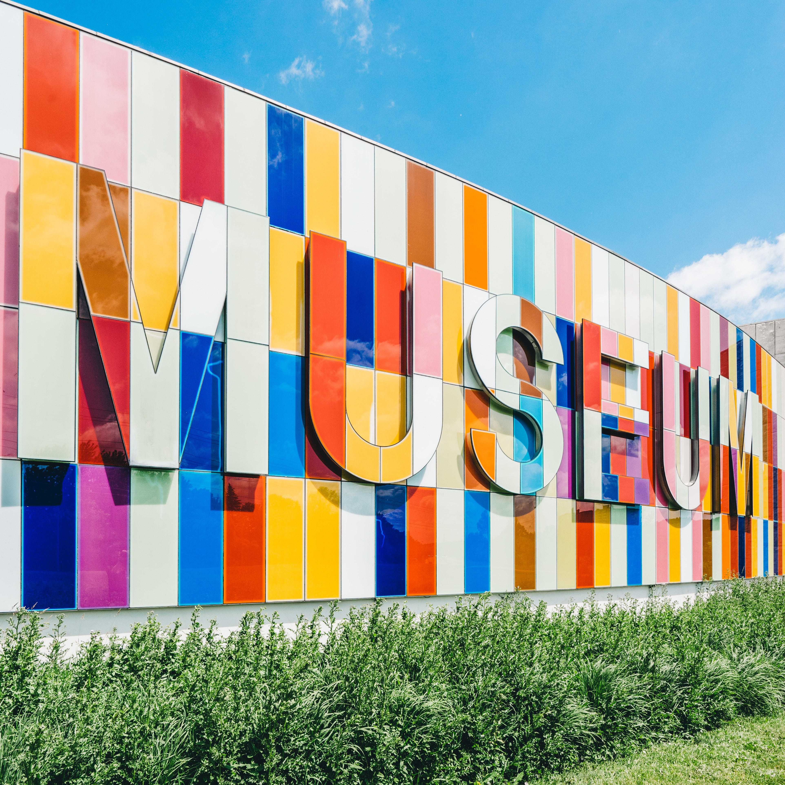

# Community Science Museum

**Explore Together** — A colourful, accessible website for the Community Science Museum. The site makes science welcoming and engaging for children, families, teachers, schools, and researchers.



## Live / Repository

- **Repository:** [github.com/Marshflair1988/Semesterproject1](https://github.com/Marshflair1988/Semesterproject1)

## Project overview

This is a multi-page, responsive front-end website built with **HTML**, **CSS**, and **JavaScript** only (no frameworks). It is designed to feel like an educational science museum: friendly, colourful, and easy to use.

### Target audience

- Children and families  
- Teachers and schools  
- Science enthusiasts  
- Researchers  

### Pages

| Page | Description |
|------|-------------|
| **Home** | Hero, tagline, intro, and preview cards linking to main sections |
| **Explore** | For Kids (Young Stars Club, Holiday Clubs), For Teachers, For Researchers |
| **Exhibitions** | Cosmology, Evolution, Biology & Medicine, Robotics & AI, Ecology |
| **Events** | Visiting Professor, Night in the Museum, Energetica exhibition |
| **Visit** | Location, admission, opening hours, accessibility, café, shop |
| **Get Involved** | Support, Volunteer, Internships |
| **Contact** | Contact form with validation |

## Tech stack

- **HTML5** — Semantic structure, accessibility (skip link, ARIA, labels)
- **CSS** — Custom design system (no Bootstrap or Tailwind): colours, typography, layout, responsive breakpoints
- **JavaScript** — Mobile navigation toggle, contact form validation (required fields, email, message length)

## Project structure

```
Semesterproject1/
├── css/
│   ├── styles.css      # Design system and main styles
│   └── responsive.css  # Media queries (tablet, mobile)
├── js/
│   ├── main.js         # Global behaviour (e.g. skip-link target)
│   ├── navigation.js   # Mobile menu toggle
│   └── formValidation.js  # Contact form validation
├── images/             # Site images (exhibitions, hero, cards, etc.)
├── index.html
├── explore.html
├── exhibitions.html
├── events.html
├── visit.html
├── get-involved.html
├── contact.html
└── README.md
```

## How to run

1. Clone the repo:
   ```bash
   git clone https://github.com/Marshflair1988/Semesterproject1.git
   cd Semesterproject1
   ```
2. Open `index.html` in a browser, or use a local server, for example:
   - **VS Code:** “Live Server” extension, then “Go Live”
   - **Python:** `python -m http.server 8000` then visit `http://localhost:8000`

No build step or dependencies are required.

## Design

- **Colours:** Deep blue, orange, teal, yellow, green; white and light grey
- **Typography:** DM Sans (Google Fonts), bold headings, readable body text
- **Layout:** Flat colours, clear hierarchy, responsive grid/flexbox
- **Responsive:** Desktop (4-column cards), tablet (2-column), mobile (1-column, collapsible nav)

## Accessibility & SEO

- Skip link to main content  
- Semantic HTML and descriptive `alt` text  
- Labelled form fields and visible focus states  
- Unique page titles and meta descriptions  
- Keyboard-friendly (e.g. Escape closes mobile menu)

## Licence

For educational use. Image assets may have their own licences; ensure appropriate attribution if required.
